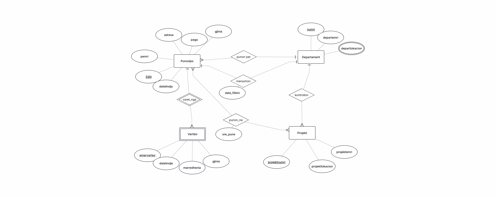

# company-database-management
# Company Database Management System

## Overview
This academic project focuses on the design and implementation of a relational database
for a private company. The database manages employees, departments, projects, and dependents,
supporting real-world organizational requirements.

## Technologies
- MySQL
- SQL
- XAMPP
- ERDPlus

## Database Design
The database includes the following main entities:
- Employees
- Departments
- Projects
- Dependents

Relationships include:
- One-to-many relationships between departments and employees

## ER Diagram

This ER diagram represents the conceptual design of the database,
including entities, attributes, and relationships.

- Many-to-many relationships between employees and projects
- Department management relationships

Primary and foreign keys are used to ensure data integrity.

## Features
- ER diagram and logical relational schema
- SQL scripts for table creation
- Example SQL queries using JOIN, WHERE, and aggregation functions
- Realistic business use case modeling

## Project Type
Academic Database Project – Individual work
